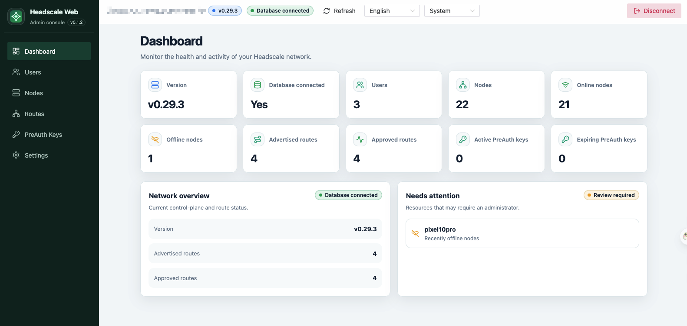
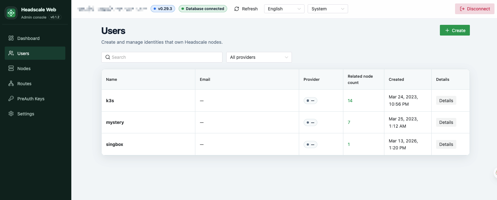
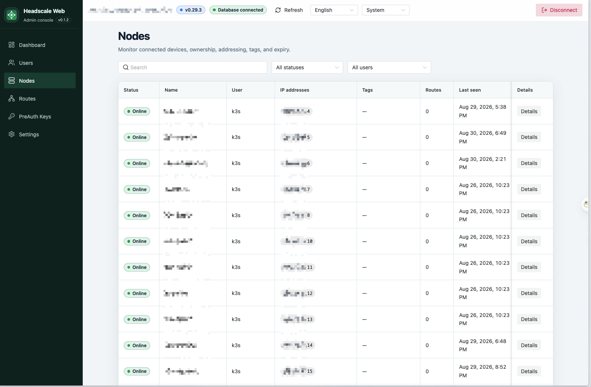
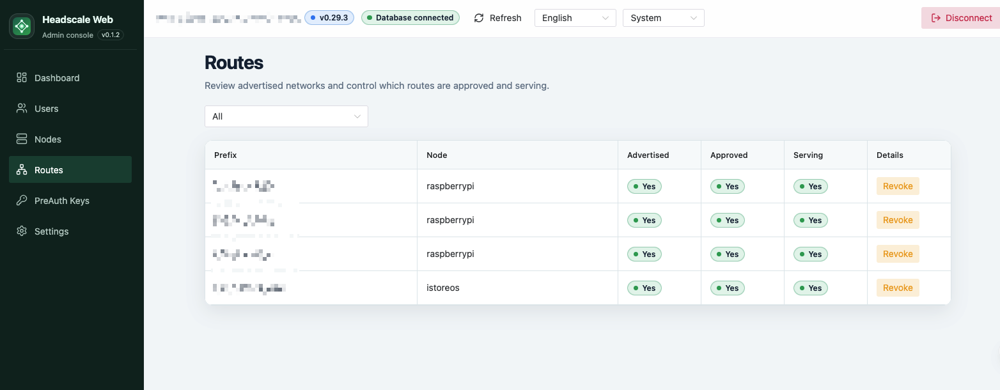
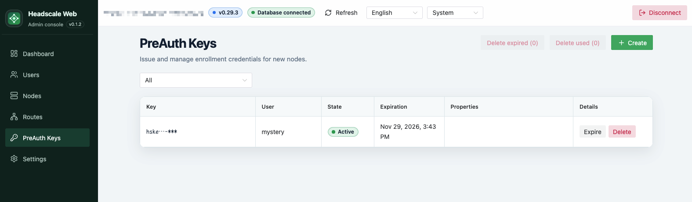
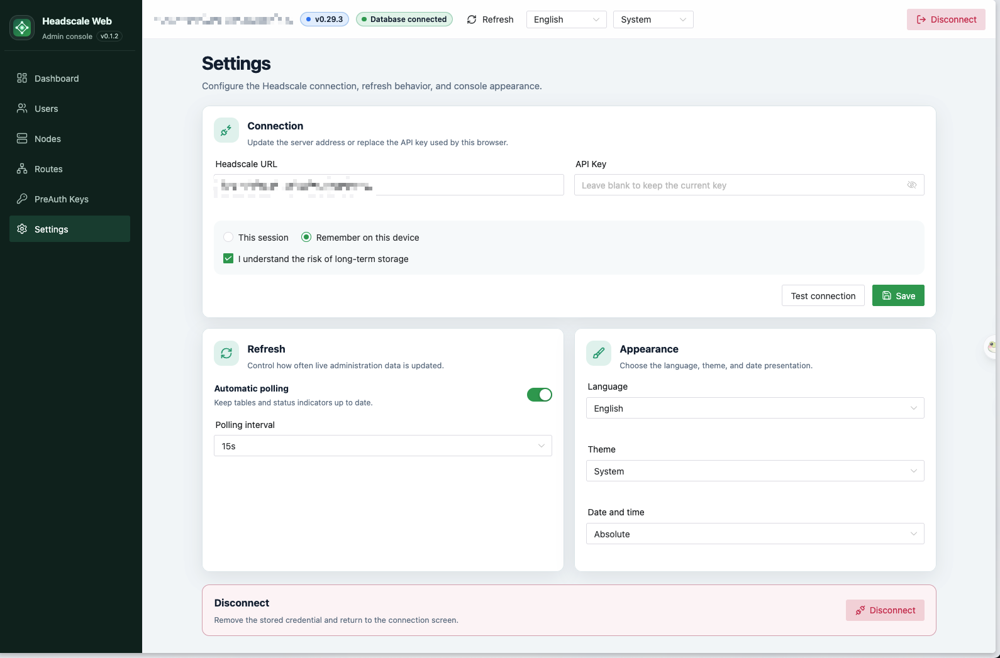

# Headscale Web

An unofficial, community-maintained web UI for [Headscale](https://github.com/juanfont/headscale).

Headscale Web is a static single-page application that connects directly to the Headscale API. It does not include a backend, database, authentication service, or server-side session layer.

> [!IMPORTANT]
> Headscale Web is not affiliated with, maintained by, or endorsed by the Headscale project.

## Preview

Try the latest released build without installing anything:

**[Open the live demo](https://mystery00.github.io/headscale-web/)**

### Screenshots



| Users                                          | Nodes                                                    |
| ---------------------------------------------- | -------------------------------------------------------- |
|  |  |

| Routes                                                            | Pre-authentication keys                                                 |
| ----------------------------------------------------------------- | ----------------------------------------------------------------------- |
|  |  |



## Features

- Dashboard with Headscale health and resource summaries
- User creation, renaming, inspection, and deletion
- Node inspection, renaming, expiry management, tags, and deletion
- Advertised and approved route management, including exit routes
- Pre-authentication key creation, expiry, and deletion
- English and Simplified Chinese interface
- Light, dark, and system themes
- Configurable refresh polling
- Headscale URL pre-filled from the browser origin when no URL has been saved
- Read-only API key expiration status with a 30-day warning and manual replacement guidance
- Deployable as static files or a multi-architecture Docker image
- Runtime Docker deployment at `/` or a subpath such as `/admin/`

## Compatibility

The current release line targets **Headscale `0.29.x`** and uses the Headscale `v0.29.3` API schema as its contract baseline.

Other Headscale versions are not currently supported. Headscale Web validates the server version when connecting and rejects incompatible versions rather than silently operating against an unknown API contract.

## Quick start with Docker

Project-maintained images are published for `linux/amd64` and `linux/arm64` on:

- `ghcr.io/mystery00/headscale-web`
- `mystery0/headscale-web`

For reproducible deployments, use a versioned image tag. The current latest release is `0.1.3`:

```bash
docker run -d \
  --name headscale-web \
  --restart unless-stopped \
  --read-only \
  --tmpfs /var/cache/nginx:rw,noexec,nosuid,size=16m,mode=1777 \
  --tmpfs /var/run:rw,noexec,nosuid,size=16m,mode=1777 \
  -p 8080:8080 \
  mystery0/headscale-web:0.1.3
```

Open `http://localhost:8080`, then enter your Headscale URL and API key. When no URL has been saved, the connection form starts with the current browser origin; replace it for an independent-origin deployment. For this independent-origin example, Headscale or its reverse proxy must allow CORS requests from `http://localhost:8080`. For production, the same-origin reverse-proxy layout described below is recommended.

The container listens on port `8080`, runs as a non-root user, and exposes a health endpoint at `/healthz`.

For subpath deployment, reverse proxies, static release archives, CORS requirements, and Docker Compose examples, see **[Deployment](docs/deploy.md)**.

## Security model

Headscale Web runs entirely in the browser. The browser must therefore hold the Headscale API key while making API requests. A static frontend cannot make that credential secret from the browser, browser extensions, or injected scripts.

- API keys are stored in `sessionStorage` by default.
- Persistent storage in `localStorage` requires an explicit user choice.
- Production deployments should use HTTPS.
- Same-origin deployment is recommended where practical.
- Settings reads API key metadata to show expiration status; it never creates, expires, revokes, or deletes API keys.
- Keys expiring within 30 days require manual replacement with the Headscale CLI.
- Access controls such as Authelia, Authentik, OAuth2 Proxy, or Cloudflare Access can restrict who opens the UI, but they do not replace the Headscale API key.

Read [`SECURITY.md`](SECURITY.md) before exposing the application outside a trusted network.

## Static releases

Each [GitHub Release](https://github.com/Mystery00/headscale-web/releases) includes:

- `headscale-web-static.tar.gz`
- `headscale-web-static.zip`
- `SHA256SUMS`

The same static build can be served at `/`, `/admin/`, or another valid subpath without rebuilding.

## Development

Requirements:

- Node.js 22 or later
- pnpm 10.32.0

```bash
pnpm install --frozen-lockfile
pnpm dev
pnpm test
pnpm build
```

To develop against a Headscale origin that does not allow browser CORS requests, create an ignored `.env.local` file:

```dotenv
HEADSCALE_PROXY_TARGET=https://your-headscale.example.com
```

Restart `pnpm dev`, then enter the Vite origin, such as `http://localhost:5173`, as the Headscale URL. Vite proxies `/version` and `/api/*` to the configured target. This proxy is for development only.

See [`CONTRIBUTING.md`](CONTRIBUTING.md) for the full development and pull request workflow. Architecture details are documented in [`docs/design.md`](docs/design.md).

## Project status

Headscale Web is released and used in self-hosted deployments. The project remains community-maintained, and compatibility is intentionally limited to explicitly tested Headscale versions.

Please use [GitHub Issues](https://github.com/Mystery00/headscale-web/issues) for reproducible bugs and feature requests. Do not disclose vulnerabilities or credentials in public issues; follow [`SECURITY.md`](SECURITY.md) instead.

## License

Headscale Web is available under the [MIT License](LICENSE).
